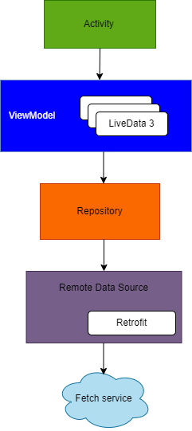
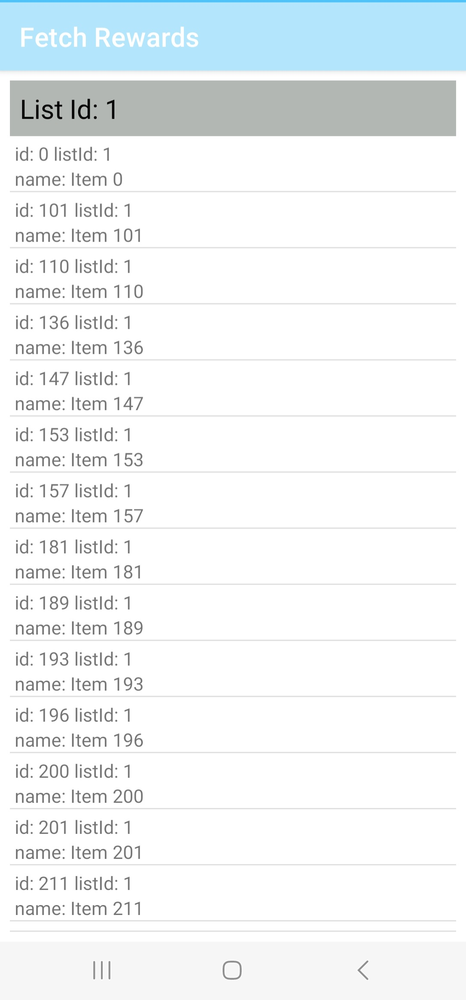

# Sample Fetch Test

A simple app that loads information from an API to demonstrate an approach to using some of the best practices in Android development. 
Including: 

* **LiveData**
* **ViewModel**
* **Hilt (for dependency injection)**
* **Kotlin Coroutines**
* **Retrofit**
  
## The following diagram shows the modules and their application interactions:

  
   
  Example: Architecture diagram.

* **Retrofit:** Library that allows us to easily obtain data from an API on the web. 
* **Repository:** This design pattern creates a good data access strategy. 
* **ViewModel:** It is in charge of accessing the data and performing the necessary transformations to display them in the view.
* **LiveData:** It is a variable where observable data is stored. Another component will observe them and act accordingly.
* **Hilt:** To perform Dependency Injection, or Dependency Injection. Based on the popular Dagger.  
## Screenshot

